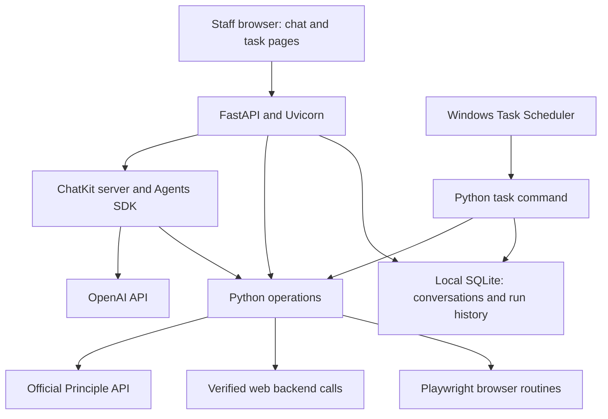

# dental_practice_admin architecture

Status: Architecture baseline; application implementation has not started.

## Purpose and constraints

dental_practice_admin is a small Python application for administrative work in Principle Dental at one dental practice. Staff use a web browser for AI-assisted interactive work and ordinary task pages. Scheduled tasks run on an always-on practice Windows host.

The architecture is planned upfront so that interactive and scheduled work share useful code without becoming a general-purpose automation platform.

Agreed constraints:

- Keep the entire custom application under 2,000 lines of code. Prefer established libraries and operating-system facilities to custom infrastructure.
- Run natively on Windows and remain maintainable by a small dental business.
- Provide chat plus simple task/results pages, accessible on the practice network or VPN.
- Support both reading and updating Principle records.
- Use ordinary Python and deterministic browser automation for scheduled work. Runtime AI is a last resort for a specific step that cannot reasonably be scripted.
- Use the official Principle API, verified web backend calls, or browser automation according to the capability required.
- Keep SMS_Bridge and the OpenDental migration investigation separate from this application.

Proposed code-budget measurement: count maintained Python, HTML, JavaScript, and setup scripts. Report tests and reproducibly generated client code separately. Dependencies are excluded. Generated code must be reproducible and must not require manual edits. Confirm this accounting before implementation; generated output is not an excuse to hide maintenance work.

The line limit is a scope constraint. If a feature would exceed it, narrow the feature or choose a better-fitting library rather than compress readable code.

## Overall design

One repository contains an importable Python package, a small web application, and command-line task entry points. There is one long-running application process. Windows Task Scheduler launches separate Python processes for scheduled work.



The agent runs in our application and calls ordinary Python tools. MCP is unnecessary for this staff interface and is excluded from the initial implementation. These operations can be exposed through MCP later if there is an actual external-client requirement.

The web application and chat server run locally; model inference uses the OpenAI API. Self-hosting the application does not make AI inference local.

## Components and library choices

| Responsibility | Recommended implementation | Reason |
| --- | --- | --- |
| Web endpoints and request validation | FastAPI and Pydantic | Small Python application with typed inputs and streaming support |
| Application server | Uvicorn, one process, standard asyncio | Native Windows operation; sufficient starting shape for one practice |
| Staff chat | ChatKit web component and Python server SDK | Reuse the chat interface and streaming protocol |
| Agent execution | OpenAI Agents SDK | Reuse model/tool orchestration |
| Task and result pages | Jinja2 templates with minimal JavaScript | Avoid a separate frontend application and build pipeline |
| Principle REST access | Assess a generated OpenAPI client; use HTTPX for a small custom client if generation proves unsuitable | Avoid hand-maintaining duplicate endpoint definitions |
| Browser automation | Playwright Python with headless Chromium | Script repeatable web-only operations |
| Local persistence | SQLite with a small storage adapter | No database server to operate |
| Web service lifecycle | Stable WinSW release | Windows service management through configuration |
| Scheduling | Windows Task Scheduler | Scheduling and process launch supplied by Windows |
| Setup and upgrades | PowerShell and pinned Python dependencies | Repeatable Windows installation |

Use a custom-server ChatKit integration, with FastAPI forwarding chat requests to the ChatKit server. Implement the required persistent ChatKit Store contract; check for a suitable maintained integration before writing an adapter. Do not assume the Agents SDK session store alone implements ChatKit's storage contract.

Only add dependencies that remove meaningful code or operational work. Pin compatible releases and update them intentionally.

## Principle integration

### Official API

Use the current published OpenAPI specification as the source for documented endpoint shapes. The saved specification in SMS_Bridge is a useful reference but may lag the published API.

Workspace API-key authentication is already used by the existing integration. Configure environment, base URL, practice scope, and credentials explicitly. Production and staging must have distinct configuration and browser session files.

Assess one maintained OpenAPI generator against the actual Principle specification before choosing a client. Check authentication headers, pagination, representative read/write schemas, Windows generation, and reproducibility. A generated client may cover the full API while the agent exposes only selected useful tools.

If generation requires extensive patching, use HTTPX and a small shared client for the endpoints required by the agreed tasks. Do not build a second model of every Principle resource or wrap every endpoint in another abstraction.

Prior reconciliation code in od_data records patient-enumeration and pagination limitations, including unreliable grand totals on some endpoints. Treat these as observations to recheck against the current API. Reports must distinguish complete results from partial coverage.

### Web backend and browser access

Existing od_data code records Firebase authentication and Firestore connections. It does not establish a complete, reusable backend API contract.

Keep verified backend calls and browser routines in small, clearly named modules. Prefer supported API operations where they provide the necessary behaviour. Use undocumented backend access only after verifying authentication, data meaning, and the complete operation being performed. A writable Firestore document does not establish that directly editing it preserves the application's business rules.

Use Playwright when the required behaviour is available only through the web application. Browser execution is deterministic by default and uses an automation-owned session.

Choose the implementation for each operation explicitly. Do not automatically switch from API to backend or browser after an uncertain write: the first attempt may already have succeeded.

## Operations, chat, and tasks

An operation is a Python function that performs a useful action, such as reading a record or carrying out an agreed administrative task. Add shared workflow code where there are actual business rules or multiple coordinated steps. Simple API requests can remain simple.

Chat tools validate their inputs and call these functions. Scheduled commands call the same functions directly, without involving a model. Practice selection and permitted actions come from trusted application configuration and the authenticated user's context, rather than solely from model-provided arguments.

Expose a small, purposeful tool set to the agent. Browser sessions, credentials, and arbitrary execution facilities are implementation details, not general tools for staff chat.

The staff interface contains:

- Chat, with persistent conversation history associated with the staff user.
- A compact list of configured tasks and recent runs.
- Results and actionable failure information.

Windows Task Scheduler owns schedule editing initially. The web page displays task identity and run history; it must not claim to show a live next-run time unless it reads that information from Windows. Avoid maintaining a second schedule definition in the application.

Record task name, run identifier, initiator, start/end time, outcome, and a useful result summary. Keep business data needed for reports separate from ordinary diagnostic logs.

For writes, validate targets and preconditions before acting. Report partial completion and uncertain outcomes. Retry reads and proven-safe operations with bounded limits; do not blindly repeat non-idempotent writes. Define whether a particular workflow needs a preview or confirmation when that workflow is specified. Scheduled jobs execute their configured scope without waiting for chat approval.

Long-running interactive tasks remain a design decision until actual workflows are known. Do not assume an in-process background callback supplies durable execution or build a general queue pre-emptively.

## Storage and configuration

Store SQLite on the host's local disk, outside the source checkout. Conversations and run records need short transactions and bounded handling of temporary contention between the web process and scheduled tasks. Browser or network activity must not hold database transactions open.

Principle remains the source of truth for practice records. Do not mirror the entire patient database unless a specific requirement justifies it.

Use explicit paths for runtime data, configuration, credentials, browser sessions, and logs. Keep secrets and authenticated browser state out of version control. Use synthetic or redacted test fixtures.

Staff authentication, conversation retention, backup retention, and detailed write permissions must be selected before staff deployment. Reuse an appropriate identity library or the practice's existing identity system rather than implement password management from scratch.

## Windows deployment

Run the web application with one Uvicorn process under WinSW. Configure automatic startup, bounded restart behaviour, and log rotation. Use the standard Windows-compatible asyncio implementation and verify Playwright subprocess execution with the pinned runtime. Development reload mode is not part of the service configuration.

Windows Task Scheduler invokes the installed Python interpreter with absolute paths and an explicit working directory. Configure jobs to run without an interactive login and prevent overlapping instances where the task requires it. Choose missed-run behaviour per task: catching up is not always appropriate for time-sensitive changes.

Use a designated Windows account with access to the application's configuration and local data. Install Playwright browser binaries at a location accessible to that account. Sessions must not depend on a developer's desktop browser or user profile. Verify any VPN-dependent access under this execution identity.

Target a Playwright-supported Windows version: current documentation lists Windows 11 or Windows Server 2019 and later. Confirm the actual production host before choosing package versions.

The PowerShell setup should install pinned dependencies, install the required browser, configure the service and tasks, and run a health check. Stop the service for updates, retain the previous working release, and keep runtime data outside the release directory. Back up SQLite through a consistent database backup mechanism.

Staff access is open to the internet so that staff can work from home without a VPN. Caddy on the practice server terminates HTTPS for `admin.massey-smiles.co.nz` and reverse-proxies `office.massey-smiles.co.nz` to SMS_Bridge on the reception machine; both names resolve to the one public address and are told apart by the Host header. The Google sign-in allowlist is therefore the only access control, and the strength of those accounts is the strength of the system.

## Proposed repository layout

```text
dental_practice_admin/
  ARCHITECTURE.md
  README.md
  pyproject.toml
  src/dental_practice_admin/
    app.py                 # FastAPI routes and application composition
    chat.py                # ChatKit server and agent tools
    principle.py           # Documented API access and configuration
    browser.py             # Task-specific Playwright routines
    tasks.py               # Business operations and command-line entry point
    storage.py             # Chat persistence and task-run records
    templates/             # Small staff pages
  tests/
  deploy/                  # PowerShell setup and Windows configuration
```

This is a working outline, not a requirement to populate empty modules. Add a backend-access module only when a verified operation requires it. Place generated API code separately if generation is selected. Keep framework declarations and business operations close enough to remain easy to navigate.

## Verification and acceptance

Use tests that establish useful behaviour rather than mirror the implementation:

- API authentication, relevant pagination, response handling, and clear failure on an unexpected contract.
- Business rules for the first actual workflows, including repeat execution and partial failure.
- Uncertain writes do not trigger a duplicate action through retries or another integration route.
- Chat and scheduled commands invoke the same tested operation.
- Conversation isolation and task access follow the chosen staff authentication model.
- An API-backed scheduled task and, when implemented, a representative browser task run under the intended Windows account without an interactive login.
- After reboot, staff can open the application and complete a chat tool call; a scheduled task executes and records its result.
- A backup can be restored and the previous application release can be reinstated.
- The maintained code count stays within the agreed budget, with generated code and tests reported transparently.

Run automated checks on Windows. Validate live behaviour against staging where available; avoid production-changing tests as routine verification.

## Decisions still required

1. Two real initial workflows, ideally one interactive and one scheduled. The lunch-blocking example is illustrative, not an agreed requirement.
2. The production Windows host, service identity, staff sign-in method, and HTTPS arrangement.
3. Whether the selected workflows need durable long-running interactive execution.
4. Which web-only capabilities are needed and what backend or browser contracts have been verified.
5. API-client generation feasibility against the current specification.
6. Conversation/result retention, backups, and workflow-specific write permissions.
7. Final code-budget accounting, particularly generated output, deployment scripts, and tests.

These decisions limit implementation readiness; they do not require expanding the architecture into a platform. The next implementation should deliver a complete small application around agreed workflows within the maintenance budget.

## References

- [Principle Dental API reference](https://api.principle.dental/)
- [ChatKit custom-server integration](https://developers.openai.com/api/docs/guides/custom-chatkit)
- [ChatKit overview and integration guidance](https://developers.openai.com/api/docs/guides/chatkit)
- [Uvicorn event loops and Windows support](https://uvicorn.dev/concepts/event-loop/)
- [Playwright Python installation and supported systems](https://playwright.dev/python/docs/intro)
- [WinSW Windows service wrapper](https://github.com/winsw/winsw)
- [Windows Task Scheduler](https://learn.microsoft.com/en-us/windows/win32/taskschd/task-scheduler-start-page)

Local references inspected during planning: SMS_Bridge's Principle client and saved OpenAPI specification, and od_data's reconciliation client and Playwright helper. Reuse confirmed behaviour and lessons from them without moving the SMS bridge or migration investigation into this application.